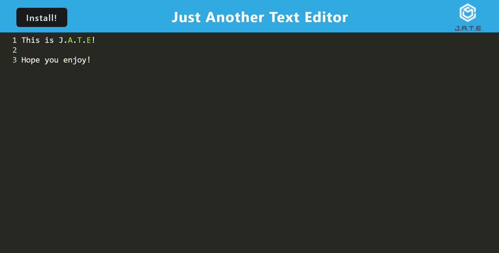

# Text Editor

### Licenses
* License Badge: 
* Link for license Badge: https://opensource.org/licenses/MIT

## TABLE OF CONTENTS
* [Description](#description)
* [Installation](#installation)
* [Contribution](#contribution)
* [Questions](#questions)
* [Deployment](#deployment)

### Description
A fun PWA text editor that can function when internet isn't available.

### Installation
This project is deployed on Railway. If you wish to use in on your maching by hand, open the terminal for this project. In the terminal, use the command "npm install" to intall the dependencies. Then enter "npm run build" followed by "npm run start".

### Contribution
Fork the repository and add anything else you think would make the project better!

### Questions
Any questions? Visit the github repository here! https://github.com/Kenny4297/Editorial-of-text

### Deployment
Here is the link to the deployment: [deployment](https://editorial-of-text-production.up.railway.app/)
